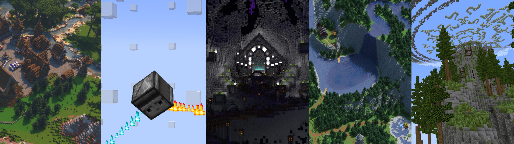

# Cartoland Bot
#### English / [台灣正體](https://github.com/AlexCai2019/Cartoland/blob/master/readme/README_tw.md) / [台語文字](https://github.com/AlexCai2019/Cartoland/blob/master/readme/README_ta.md) / [粵語漢字](https://github.com/AlexCai2019/Cartoland/blob/master/readme/README_hk.md) / [简体中文](https://github.com/AlexCai2019/Cartoland/blob/master/readme/README_cn.md)


## Description
The source code of Cartoland Bot, a discord bot developed for a server named Cartoland. Join Cartoland here: https://discord.gg/UMYxwHyRNE

## Required folders and files
For performance reasons, this bot won't verify if all the necessary paths and files exist. If you want to run the bot yourself, you must have the following folders and files:
- 📄`config.properties` with properties of
  - `token`
  - `db.url`
  - `db.users`
  - `db.password`
- 📁`dms/`
- 📁`lang/` with all `.json` files found in the `lang/` folder of this repository.
- 📁`logs/`
- 📁`serialize/` with these following files:
  - 📄`unresolved_questions.ser` serialized from a `HashSet` which use `Long` as value.

## Launching
Start the bot by running the following command in your terminal:
```
java -jar Cartoland.jar
```
Set the `token` property in `config.properties` with the token of your own bot. Make sure you have all the required folders and files before launching.