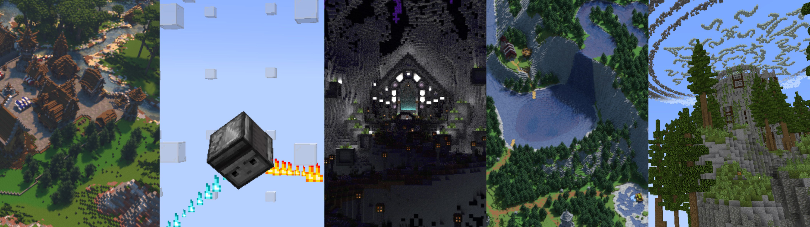

# Cartoland Bot
#### [English](https://github.com/AlexCai2019/Cartoland/blob/master/readme/README.md) / [台灣正體](https://github.com/AlexCai2019/Cartoland/blob/master/readme/README_tw.md) / [台語文字](https://github.com/AlexCai2019/Cartoland/blob/master/readme/README_ta.md) / 粵語漢字 / [简体中文](https://github.com/AlexCai2019/Cartoland/blob/master/readme/README_cn.md)


## 簡介
屬於名為創世聯邦的Discord伺服器的Cartoland Bot的原始碼。透過此連結加入創世聯邦：https://discord.gg/UMYxwHyRNE

## 必備的資料夾和檔案
為咗節省效能，本機器人並唔會特別檢查你嘅文件夾同文件是否符合條件。因此，你必須準備好以下嘅文件夾同文件，先可以令機器人正常運作：
- 📄`config.properties` with properties of
  - `token`
  - `db.url`
  - `db.users`
  - `db.password`
- 📁`dms/`
- 📁`lang/`，以及本專案的 `lang/` 文件夾內的所有 `.json` 文件。
- 📁`logs/`

## 啟動
透過在終端機輸入以下的指令啟動機器人：
```
java -jar Cartoland.jar <權杖>
```
用你自己的機器人的權杖取代 `<權杖>` 引數。務必確保你有必備的資料夾和檔案。